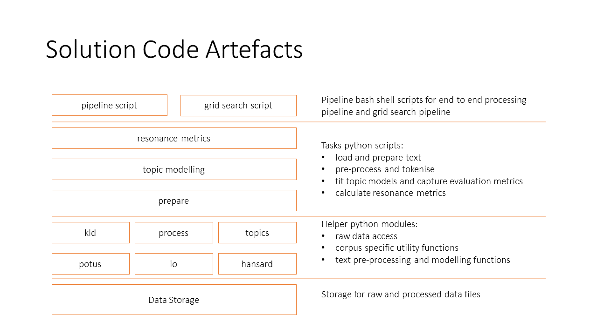

# ilab2
ilab2: Novelty and Transience in Politcs

## Code Artefacts

## Documentation

* helpers:
    * [io](./md/helpers/io.md)
    * [hansard](./md/helpers/hansard.md)
    * [potus](./md/helpers/potus.md)
    * [process](./md/helpers/process.md)
    * [kld](./md/helpers/kld.md)
    * [topics](./md/helpers/topics.md)

## Datasets

Brown, D. W. (2016) Corpus of Presidential Speeches. Retrieved from http://www.thegrammarlab.com

Sharratt, T., 2019.  Github Repositories retrieved 8 September 2020 from https://github.com/GLAM-Workbench/australian-commonwealth-hansard and github.com/wragge/hansard-xml under MIT licence, © Tim Sharratt 2019.
